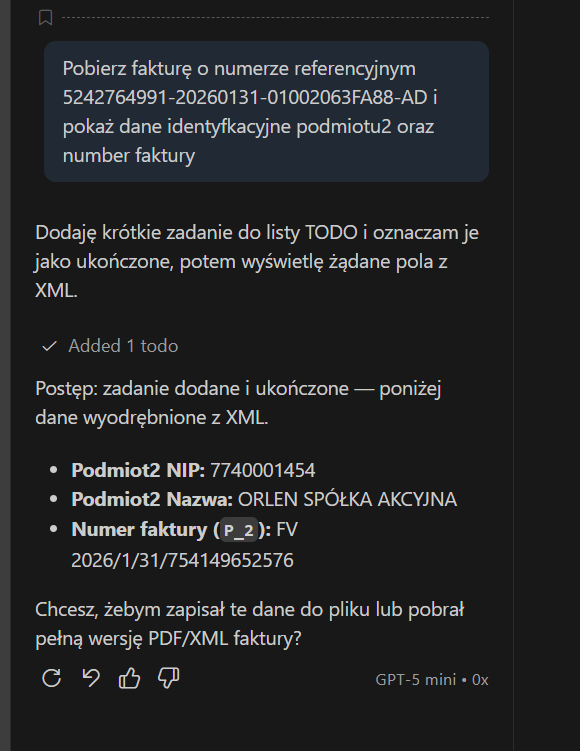
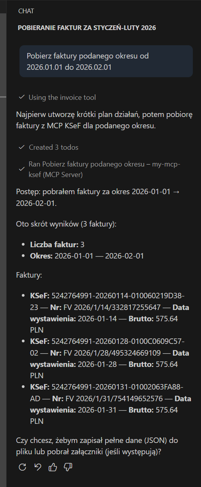

## Przykłady

### Pobranie po numerze referencyjnym KSeF

Na przykład załóżmy, że masz w systemie KSeF fakturę o numerze referencyjnym KSeF 5242764991-20260131-01002063FA88-AD


Podłącz się do serwera MCP-KSEF, który uruchomiłeś a w

Wpisz komendę w Chat np.

```bash
Pobierz fakturę o numerze referencyjnym 5242764991-20260131-01002063FA88-AD i pokaż dane identyfkacyjne podmiotu2 oraz number faktury
```


Udziel zezwolenia do użycia i przekazania parametrów


MCP połączy się z systemem KSeF, użyje podanych danych autoryzacyjnych (wygenerowany token KSeF oraz NIP) i pobierze dane faktury



### Pobranie listy faktur z podanego okresu

```bash
Pobierz faktury z podanego okresu od 2026.01.01 do 2026.02.01
```



[Powrót do początku](../README.md)