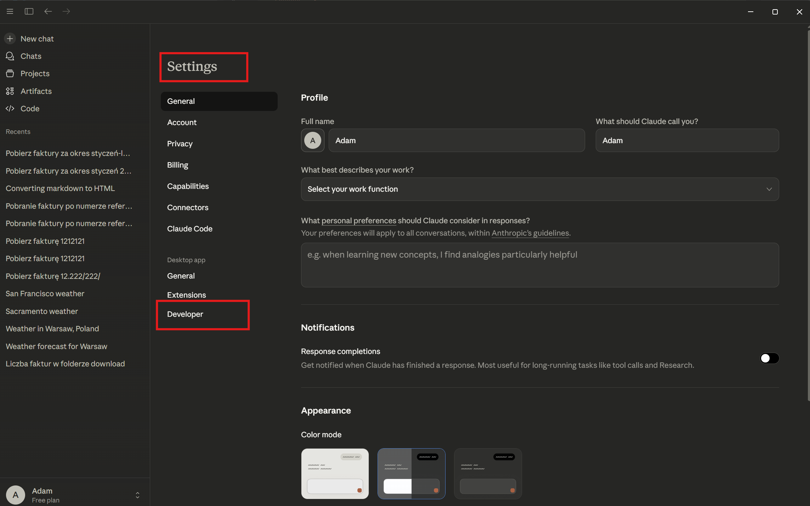
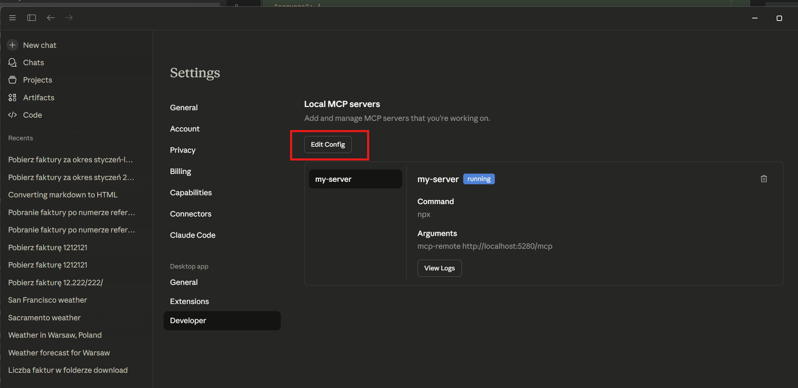
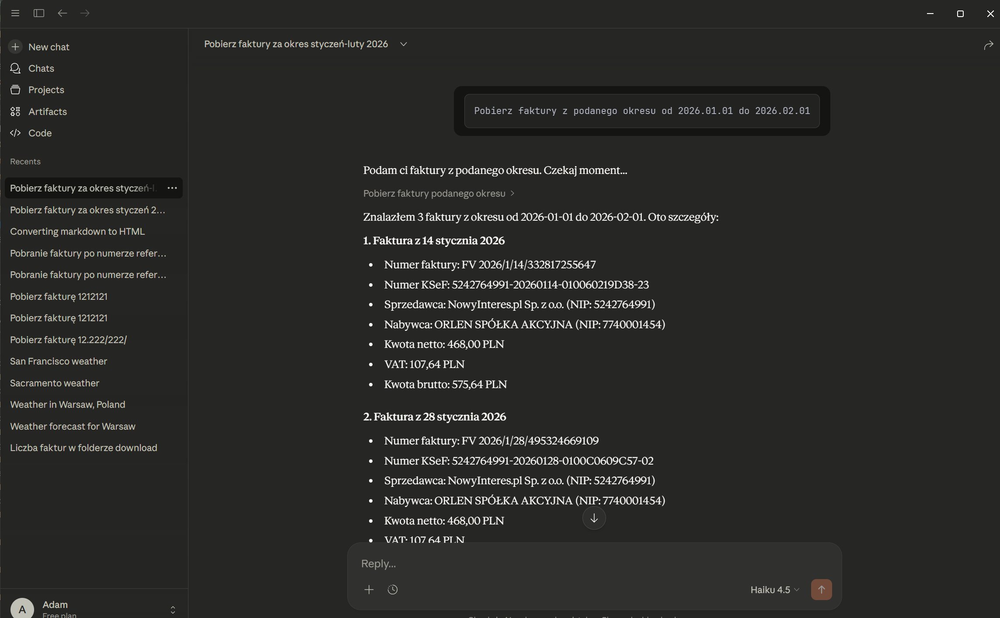
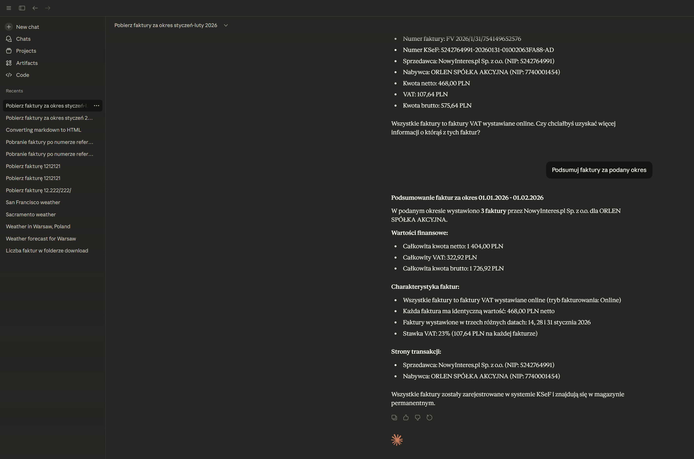

## Jak skonfigurować klienta Cloud Desktop

1. Zainstaluj Cloud Deskop [Cloud Desktop](https://claude.com/download)

2. Uruchom klienta Cloud Desktop, zaloguj się i przejdź do ustawień (Settings).



3. Kliknij na ustawienia dewelopera (Developer)



4. Następnie zmień plik konfiguracji claude_desktop_config.json na


```json
{
  "mcpServers": {
    "my-server": {
      "command": "npx",
      "args": ["mcp-remote", "http://localhost:5280/mcp"]
    }
  }
}
```

zakładając ze uruchomiłeś MCP na porcie 5280 (lub jako Docker na 8080 zmieniając wartość).

5. Zamknij (exit) Cloud Desktop i uruchom ponownie.

6. Po ponowym uruchomienu Cloud Desktop powinen mieć możliwość współpracy z MCP i KsEF.

Wpisz np. 

`
Pobierz faktury z podanego okresu od 2026.01.01 do 2026.02.01
`



Cloud powinien pobrać faktury.

Zawuważ, źe Cloud Desktop trzyma kontekst i możes dalej danymi faktur robić co chcesz np.

`
Podsumuj faktury za podany okres
`



[Powrót do początku](../README.md)