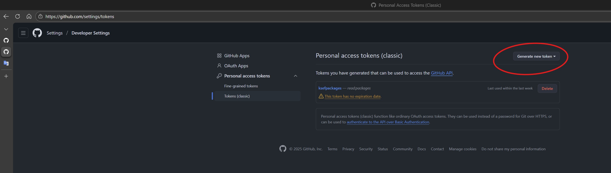

# MCP KSeF Server

To jest serwer MCP dla KSeF - Krajowy System e-Faktur to platforma do wystawiania, przesyłania, otrzymywania i przechowywania faktur.

**Serwer MCP w rozwoju. Na razie działa tylko pobieranie faktur. Będą dodawane nowe funkcje.** 

## Instalacja

[](https://vscode.dev/redirect?url=vscode%3Amcp%2Finstall%3F%7B%22name%22%3A%22markdown-to-html%22%2C%22gallery%22%3Afalse%2C%22command%22%3A%22docker%22%2C%22args%22%3A%5B%22run%22%2C%22-i%22%2C%22--rm%22%2C%22ghcr.io%2Fmicrosoft%2Fmcp-dotnet-samples%2Fmarkdown-to-html%3Alatest%22%5D%7D) [](https://insiders.vscode.dev/redirect?url=vscode-insiders%3Amcp%2Finstall%3F%7B%22name%22%3A%22markdown-to-html%22%2C%22gallery%22%3Afalse%2C%22command%22%3A%22docker%22%2C%22args%22%3A%5B%22run%22%2C%22-i%22%2C%22--rm%22%2C%22ghcr.io%2Fmicrosoft%2Fmcp-dotnet-samples%2Fmarkdown-to-html%3Alatest%22%5D%7D) [](https://aka.ms/vs/mcp-install?%7B%22name%22%3A%22markdown-to-html%22%2C%22gallery%22%3Afalse%2C%22command%22%3A%22docker%22%2C%22args%22%3A%5B%22run%22%2C%22-i%22%2C%22--rm%22%2C%22ghcr.io%2Fmicrosoft%2Fmcp-dotnet-samples%2Fmarkdown-to-html%3Alatest%22%5D%7D)

## Wymagania

- [.NET 9 SDK](https://dotnet.microsoft.com/download/dotnet/9.0)
- [Visual Studio Code](https://code.visualstudio.com/) with
  - [C# Dev Kit](https://marketplace.visualstudio.com/items/?itemName=ms-dotnettools.csdevkit) extension

## Co zawiera

Markdown to HTML MCP server includes:

| Building Block | Name                     | Description                                     | Usage                       |
|----------------|--------------------------|-------------------------------------------------|-----------------------------|
| Tools          | `get_invoice_by_ksef`    | Pobranie faktury w XML na podstawie numeru KSeF | `#get_invoice_by_ksef` |

## Jak to użyć

### Docker image

1. Image docker jest gotowy do ściągnięcia i instalacji w publiczny repozytorium Docker Hub jako [herbat73/mcp-ksef](https://hub.docker.com/repository/docker/herbat73/mcp-ksef/)

2. Uruchomienie

```bash
docker run -e KSEF_TOKEN="tutaj twój token ksef" -e KSEF_VATID="tutaj wpisz number nip" -p 8080:8080 herbat73/mcp-ksef:0.1 --http
```

2. Przykładowa konfiguracja klienta jako plik mcp.json

```json
{
  "servers": {
    "my-mcp-ksef": {
      "type": "http",
      "url": "http://localhost:8080/mcp"
    }
  },
  "inputs": []
}
```

### Budowanie

Przy budowaniu programu potrzebujesz ściągnąć nuget z KSeF Clientem który dostępny jest tylko na GitHub Packages.

Aby uzyskać dostęp do pakietów z GitHub Packages, musisz utworzyć osobisty token dostępu (PAT) z odpowiednimi uprawnieniami.

Ścieżka:

```bash
GitHub -> Settings -> Developer settings -> Personal access tokens -> Tokens (classic) -> Generate new token -> Generate new token (classic)
```

W sekcji Wybierz zakresy zaznacz read:packages, a następnie wygeneruj i skopiuj wartość tokena (będzie widoczna tylko raz).



```bash
dotnet nuget add source "https://nuget.pkg.github.com/CIRFMF/index.json" --name github-cirf --username token --password TUTAJ_PAT_TOKEN --store-password-in-clear-text
```

### Uruchamianie serwera MCP

#### Na maszynie lokalnej

1. Uruchomienie serwera MCP.

 ```bash
 cd $REPOSITORY_ROOT/Mcp-Ksef.HybridApp
 dotnet run --project ./Mcp-Ksef.HybridApp
 ```

   **Parametry**:

   - `--http`: Przełącznik wskazujący, że serwer MCP ma działać jako serwer strumieniowy HTTP. Po dodaniu tego przełącznika adres URL serwera MCP będzie następujący: `http://localhost:5280`.
   - `--use-ksef-production`: Przełącznik wskazujący czy należy użyć serwera produkcyjnego, domyślnie bez przełącznika MCP użyje serwera testowego.

   **Zmienne środowiskowe**:
   
   Ustaw zmienne środowiskowe potrzebne do dostępu do KSeF

   - `KSEF_TOKEN`: - token KSeF wygenerowany w systemie KsEF (dla wybranego systemu Test lub Produkcja).
   - `KSEF_VATID`: - NIP firmy dla której chcesz użyć systemu KsEF

   Z tymi parametrami możesz użyć serwera MCP w trybie HTTP strumieniowym z dostępem do systemu produkcyjnego (https://api.ksef.mf.gov.pl) jak:

```bash
dotnet run -e KSEF_TOKEN='tutaj wklej token ksef' -e KSEF_VATID='Tutaj NIP firmy' --project ./Mcp-Ksef.HybridApp -- --http --use-ksef-production 
```

Serwer uruchomi się domyślnie nasłuchując na porcie 5280

```bash
Starting MCP KSeF for VatId : Tutaj NIP firmy
useProductionServer : True - KSeF API URL: https://api.ksef.mf.gov.pl used
...
Now listening on: http://localhost:5280
```

Podobnie uruchomienie w trybie transportowym STDIO (--http) np. systemu testowego (nie wymaga parametru --use-ksef-production)

```bash
dotnet run -e KSEF_TOKEN='tutaj wklej token ksef' -e KSEF_VATID='Tutaj NIP firmy' --project ./Mcp-Ksef.HybridApp
```

Pozwoli na dostęp do KSeF API (https://api-test.ksef.mf.gov.pl)

Zatrzymanie serwera Ctrl-C

### Test

1. Uruchom projekt do dowolnego środowiska np. test dla transportu HTTP strumieniowy

```bash
 dotnet run -e KSEF_TOKEN='tutaj wklej token ksef' -e KSEF_VATID='Tutaj NIP firmy' --project ./Mcp-Ksef.HybridApp -- --http
```

2. Uruchom klienta MCP np. Visual Studio Code, konfiguracja mcp.json

```json
{
   "servers": {
      "my-mcp-ksef-http": {
         "type": "http",
         "url": "http://localhost:5280/mcp"
      }
   },
   "inputs": []
}
```

3. Na przykład załóżmy, że masz w systemie KSeF fakturę o numerze referencyjnym KSeF 5242764991-20260131-01002063FA88-AD


3. Podłącz się do serwera MCP-KSEF, który uruchomiłeś a w 

Wpisz komendę w Chat np.

```bash
Pobierz fakturę o numerze referencyjnym 5242764991-20260131-01002063FA88-AD i pokaż dane identyfkacyjne podmiotu2 oraz number faktury
```


Udziel zezwolenia do użycia i przekazania parametrów


MCP połączy się z systemem KSeF, użyje podanych danych autoryzacyjnych (wygenerowany token KSeF oraz NIP) i pobierze dane faktury


